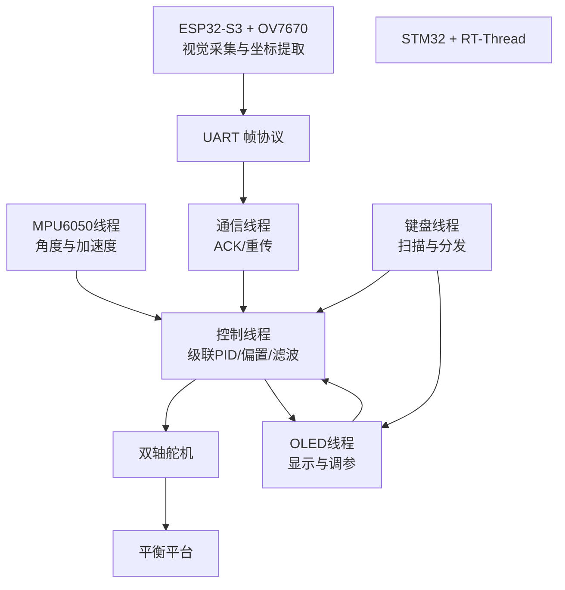
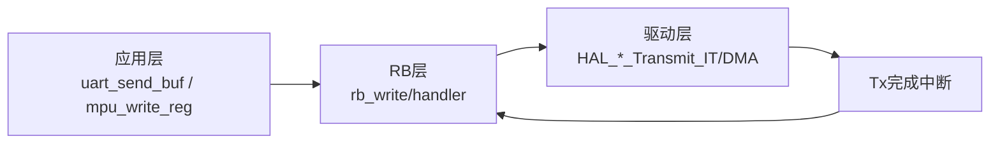
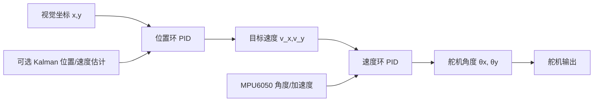
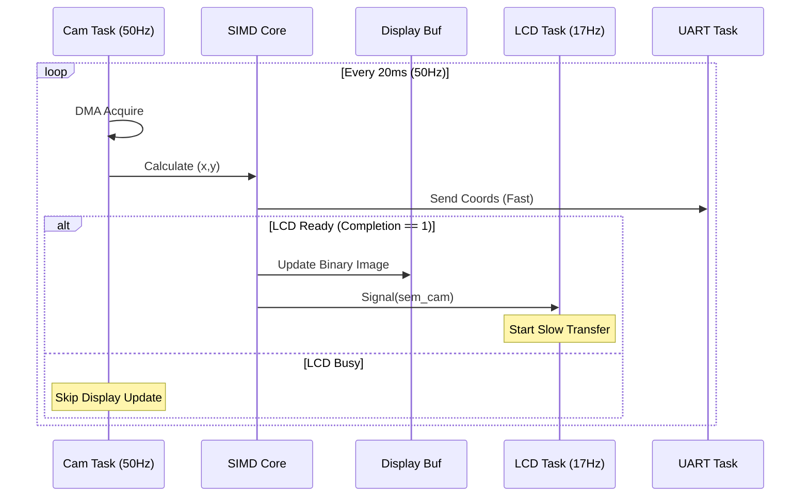

# 双核视觉球平衡控制系统 (RT-Thread + FreeRTOS)

本项目是一个基于 **STM32F1 (控制)** 与 **ESP32-S3 (视觉)** 双核异构架构的嵌入式球平衡系统。采用 **RT-Thread** 与 **FreeRTOS** 双实时操作系统协同工作，通过高频视觉闭环实现了对运动轨迹的动态跟踪与稳态平衡。

### 🚀 核心技术亮点
- **异构双核协同**：STM32 负责高实时性运动控制（级联 PID），ESP32-S3 负责高吞吐量视觉计算（SIMD 加速），通过自定义 **UART 帧协议 + ACK 重传机制** 保障通信可靠性。
- **高频视觉与 SIMD 加速**：基于 **Xtensa SIMD 指令集** 优化 YUV422 到二值化的图像处理流水线，在 **50FPS** 满帧率采集下，利用 **异步显存架构** 解决了 OV7670 高速写入与 ST7789 低速刷屏 (17FPS) 的带宽冲突。
- **高阶控制算法**：控制层采用 **位置环 + 速度环级联 PID**，结合 **MPU6050 互补滤波** 姿态解算与 **Kalman 滤波器** 融合编码器数据，实现了系统的抗干扰与稳态高精度。
- **工业级软件架构**：基于 **I/O 多路复用** 与 **RingBuffer** 实现的异步通信驱动，以及分层清晰的线程/任务模型。


---

## ✅ 实现功能

### 核心功能
- **小球平衡闭环控制**：二维位置环 + 速度环级联 PID，输出双轴舵机角度。
- **视觉位置输入**：通过 UART 与 ESP32-S3 通信，接收球心坐标 $(x, y)$ 及帧率信息。
- **姿态/加速度融合**：MPU6050 角度估计（互补滤波），可选位置 Kalman 预测更新。
- **偏置自动校准**：自动计算舵机中位偏置，稳定机械装配误差。

### 交互与显示
- **OLED 多页面菜单**：菜单页 / 调试页 / 传感器页 / ESP 信息页。
- **矩阵键盘交互**：切换页面、调整 PID、切换模式等。
- **串口调试输出**：支持速度、位置、角度等关键量观测。

---

## 🧩 系统架构

### 总体架构（数据流）


### 分层设计
- **感知层**：MPU6050、视觉输入（ESP32）、编码器
- **控制层**：PID / Kalman / 状态机
- **执行层**：PWM 舵机驱动
- **交互层**：OLED + 矩阵按键
- **通信层**：UART 帧协议 + ACK 重发
- **驱动抽象层**：I2C/SPI/UART 统一 RB 队列 + IT/DMA 链式发送

---

## 📁 项目结构（核心部分）
```text
stm32_rtthread/
├─ _threads/
│  ├─ communicate_thread.c   # ESP32 通信与帧协议解析
│  ├─ keypad_thread.c        # 矩阵按键扫描与状态分发
│  ├─ mpu_thread.c           # MPU6050 姿态解算更新
│  ├─ oled_thread.c          # OLED 界面显示与交互
│  └─ servo_thread.c         # PID 控制与舵机输出
└─ applications/
   ├─ main.c                 # RT-Thread 入口
   ├─ drv_uart.c             # UART 帧收发驱动
   ├─ encoder.c              # 编码器读取
   ├─ kalman.c               # 位置 Kalman 预测/更新
   ├─ keypad.c               # 矩阵键盘底层驱动
   ├─ mpu6050.c              # I2C 读取与互补滤波
   ├─ mylib.c                # 核心控制算法与通用数学辅助库
   ├─ oled.c / oled_data.c   # OLED 屏幕驱动与字模
   ├─ ring_buff.c            # 环形缓冲区(RB)实现
   ├─ servo.c                # PWM 舵机驱动
   └─ shared_drive_init.c    # 外设统一初始化调度
├─ tools/
│  ├─ serial_monitor.py      # STM32 串口数据流监控与记录脚本
│  └─ data_analyze.py / plotter.py # 数据分析与波形绘制工具

esp32/
├─ camera_viewer.py          # ESP32 摄像头图像 PC 端预览与调试工具
├─ main/
│  ├─ main.c                 # FreeRTOS 任务启动与系统初始化
│  ├─ task/
│  │  ├─ cam_task.c          # 采集/二值化/质心计算
│  │  ├─ communicate_task.c  # UART 帧协议通信
│  │  ├─ lcd_task.c          # TFT 刷屏
│  │  └─ shell_task.c        # 命令行调试监控
│  └─ drivers/
│     ├─ drv_install.c       # 底层外设安装与初始化
│     ├─ drv_uart.c          # ESP32 UART 底层封装
│     ├─ my_ov7670.c         # OV7670 配置与初始化
│     ├─ tft.c               # ST7789 屏幕驱动
│     └─ typedef.h           # 全局宏开关与类型定义
└─ CMakeLists.txt            # ESP-IDF 项目构建脚本
```

---

## 🧠 软件设计与实现

## 1) 线程与 IPC 设计

### STM32 部分（RT-Thread）

| 线程 | 文件 | 优先级 | 频率/触发 | 作用 | IPC / 同步机制 |
|---|---|---|---|---|---|
| `communicate_thread` | `_threads/communicate_thread.c` | 6 (较高) | 事件驱动 | 与 ESP32 通信，解析帧、ACK 重发、写入队列 | `rt_mq_t mq_xy` (Pro) |
| `servo_thread` | `_threads/servo_thread.c` | 7 (较高) | 消息驱动 | 位置/速度闭环控制 + 舵机输出 | 消费 `mq_xy`、`mb_mpu` (Con) |
| `mpu_thread` | `_threads/mpu_thread.c` | 15 (中) | 1kHz (1ms延时) | MPU6050 采样 + 角度计算 | `rt_mb_t mb_mpu` (Sync) |
| `keypad_thread` | `_threads/keypad_thread.c` | 18 (较低) | 50Hz (20ms延时) | 矩阵键盘扫描与去抖 | `rt_sem_release` (Signal) |
| `oled_thread` | `_threads/oled_thread.c` | 20 (较低) | 5Hz (200ms延时) | OLED 渲染 + 页面切换 | `rt_mb_t mb_to_oled` (Msg) |

### ESP32 部分（FreeRTOS）

| 任务 | 文件 | 优先级 | 频率/触发 | 作用 |
|---|---|---|---|---|
| `cam_task` | `main/task/cam_task.c` | 21 (高) | 50Hz (摄像头驱动) | 采集图像、二值化/裁剪、质心计算、发送坐标 |
| `communicate_task` | `main/task/communicate_task.c` | 20 (中高) | 消息驱动 | UART 帧协议发送坐标/帧率 |
| `lcd_task` | `main/task/lcd_task.c` | 19 (中) | 信号量驱动 | 将二值图像输出到 TFT，统计显示帧率 |
| `shell_task` | `main/task/shell_task.c` | 5 (低) | 命令行输入驱动 | USB-JTAG 监控 shell（任务、堆栈、内存） |

#### 关键同步与互斥设计
1. **STM32 外设互斥**：
   - I2C 总线（`my_hi2c1`）同挂载了 MPU6050 与 OLED。
   - 在 `shared_drive_init.c` 中，底层驱动使用 `rt_sem_take/release`  保护 I2C 读写操作，防止 MPU6050 高频读取打断 OLED 耗时刷新，导致总线仲裁丢失。
2. **ESP32 跨任务同步**：
   - **`sem_cam` (Binary Sem)**：`cam_task` 完成一帧图像二值化后释放信号量，唤醒 `lcd_task` 进行刷屏。
   - **`Completion` (Volatile Flag)**：简单的标志位，防止 `cam_task` 覆盖尚未刷屏显存（简单的双缓冲替代方案）。
3. **ESP32 数据流同步**：
   - **`xMailbox` (Queue)**：多对一模型，`cam_task`（坐标/FPS）与 `lcd_task`（显示FPS）均向此队列投递消息，`communicate_task` 统一取出并通过 UART 发送，避免了多任务直接操作 UART 的竞态。

---

### 2) 通信协议设计（STM32 ↔ ESP32）
STM32（控制流）与 ESP32-S3（视觉流）之间通过 UART 进行高频通信。为保障双核异步通信在 50Hz 高频率下的可靠性与低延迟，防止脏数据干扰 PID 运算，设计了一套包含 **流控、状态机解包、序号去重、CRC校验与 ACK 重发机制** 的轻量级定制帧协议（代码见 `_threads/communicate_thread.c`）：

#### 2.1 帧结构设计与校验
数据的封装严格遵循基于固定帧头与校验尾的变长结构：

**帧结构定义**： `[0xAA 0xBB] | SEQ (1 Byte) | LEN (1 Byte) | 变长 DATA (含命令字/Type)... | CRC8 (1 Byte)`

*   **帧头识别**：使用 `0xAA 0xBB` 标记数据包的开始。
*   **序列号 (SEQ)**：发送端每次成功发送新数据后递增，用于数据包的追踪、接收端的去重以及精确的 ACK 确认。
*   **CRC8 校验码**：循环冗余校验（多项式 0x31）涵盖从 SEQ、LEN 一直到不定长的数据段。确保数据在总线上的传输没有任何位翻转或截断，保障控制系统不被错误的乱码数据（如球越界坐标）干扰引发飞车。

#### 2.2 接收端状态机解析机制 (State Machine Receiver)
接收任务（`listen_to_esp`）没有使用一股脑的长阻塞读取，而是严格采用了分阶段、逐级判定跳出的状态机断言流来解开每一帧，有效防报错位并减轻 CPU 开销：
1.  **WAIT_HEAD（寻头状态）**：独立读取判断，严格匹配接连的 `0xAA` 和 `0xBB`。一旦其中一个不对，马上抛出错误以重置状态，迅速刷出不合法的半片残帧，防止错位连累后续接收。
2.  **CHECK_SEQ（序号校验状态）**：头校验通过后，仅提取 1 字节 SEQ 并核实。若发现与上次收到的 `rx_seq` 相同，则能在正式接手庞大数据包之前将其识别为“迟到的重发帧”，当场阻断不投放到 PID 中。
3.  **WAIT_PAYLOAD（变长装载状态）**：跨过序号检查后读出 `LEN` 码，利用该参数精准限制本次只读取所需的指定字节片段数，结合定长协议的安全与变长协议的灵活。
4.  **VERIFY_CRC（尾差校验状态）**：最后独立读取末尾帧判定字节，进行异或比对，不吻合马上放弃全部已提取结果，静默处理以触发接收端的超时重传。

#### 2.3 重传机制与错误处理
*   **ACK 确认与超时重传**：协议采用经典的**停止-等待协议 (Stop-and-Wait ARQ)**。发送端发出后会陷入阻塞，最多等待 `ACK_RETRY_MS`（典型设定 5ms）以监听接收端回应的对应 SEQ 标识字符。如果超时未收到，发送端将认为发生掉包，自动重复发送整个完整包（包含旧 SEQ）。
*   **异常阻断（最大重试）**：若发生线路中断，重发次数将累加。当等待时间达到应用层规定的最大总超时限度时，任务将强制退出当前阻塞循环并抛出超时错误 (`RT_ETIMEOUT`)，从而保护控制线程与系统通讯池不受 UART 死锁或一直挂挂起的拖累。

#### 2.4 数据流控与脏数据恢复
*   **SEQ 去重机制与平滑乱序**：接收端检测到合法帧头并提取 SEQ 时，检测本次接受的序号与上一包的 `rx_seq` 是否一模一样。如果在网络抖动时发生了 ACK 延误导致发送端又**重新重传**了相同数据，STM32 此时如果再次把此数据塞入队列将导致 PID 的差分时间片受到污染。因此控制系统面对这种情况会**主动将数据丢弃（不进队列）**，并在同时**补发一次该 SEQ 的 ACK 确认**以解开对方的延时阻塞。
*   **CRC 故障与强制抛弃**：接收端完全加载完数据缓冲，并通过软件核对最后的 CRC8。如果与接收的不一致，系统将静默退出且**绝对不会回传 ACK**，从物理上迫使对方由于获取不到 ACK 而触发**超时重发**操作。
*   **RingBuffer (RB) 队列复位流控**：针对帧错位或者上述的 CRC 损坏、重复帧包抛弃事件，接收端会主动调用 `uart_rx_buf_clear()` 清洗当前驱动层维护的环形接受缓冲池（RingBuffer）。这能以极快的效率把堵塞的干扰数据流刷出，提供流控机制的稳定性，防止当前错帧残局连累到下一个到达的完整通信帧的检索识别。

#### 2.5 数据载荷分类定义 
在解包后的变长 Data 载荷中，采用首字节 (Type) 区分不同通道的消息以路由到不同的队列：
- `type=1`：ESP 摄像 FPS（发往 OLED 显示）
- `type=2`：球坐标 $(x,y)$（核心数据：投递进入 `mq_xy` 消息队列供伺服控制计算速度误差）
- `type=3`：显示屏 FPS（发往 OLED 统计侧）

---

##  stm32控制侧


### 1 ) 异步链式发送与驱动解耦（RB 设计）

该工程的 I2C/SPI/UART 都使用 **统一的环形缓冲区 (RB) + 回调链式发送**，实现“上层无感知的异步输出”，核心实现在：
- `applications/ring_buff.c/.h`
- `applications/shared_drive_init.c`

#### 设计目标
- **应用层无阻塞**：上层只需要 `uart_send_buf()` / `mpu_write_reg()`，不关心底层是 IT 还是 DMA。
- **多线程并发安全**：RB 结构底层内置了互斥锁 (`rt_mutex`) 保护。无论是调用 I2C、SPI 还是 UART 的输出层，都天然支持多线程乱序高频并发写入，保障了公共总线数据在被封装塞入环形缓冲区时的线程安全。
- **驱动层解耦**：I2C/SPI/UART 统一由 RB 抽象，设备与协议可复用。
- **链式发送**：上一帧完成后自动发送下一帧，不需要显式调度。

#### 核心机制（以 UART 为例）
1. **上层写入 RB (处理回绕)**：
	- `uart_send_buf()` → `rb_write()`
	- **自动分段**：当数据跨越缓冲区尾部时，`rb_write` 自动执行 **两次 `memcpy`**（一段填满尾部，剩余写入头部），向上层屏蔽物理内存环形结构。
2. **RB 触发链式发送**：
	- 当 `rb->isfree` 为 1 时立即触发 `rb->data_handler()`
3. **发送完成回调继续取帧**：
	- `HAL_UART_TxCpltCallback()` → `rb_ITcallback()` → `rb_uartX_handler()`
4. **驱动层按 frame_head 的 mode 自动选择 IT/DMA**

#### 抽象层解耦示意


该结构对 I2C/SPI/UART 均通用，**设备只需填充 `frame_head_t.device` 即可复用**。

---

### 2) 控制策略设计

#### 控制流程图


#### 2.1 级联 PID（位置环 + 速度环）
控制主逻辑位于 `_threads/servo_thread.c`：

1. **外环：位置 PID**
	- 输入：球当前位置 $x, y$
	- 输出：目标速度 $v_x, v_y$

2. **内环：速度 PID**
	- 输入：当前速度（由位置差分 / Kalman 估计）
	- 输出：舵机角度 $\theta_x, \theta_y$

输出限制与积分分离：
- `pid->integral_range` 实现积分分离
- `pid->output_limit` 实现输出限幅

#### 2.2 可选 Kalman 位置滤波
文件：`applications/kalman.c`，用于解决坐标数据噪声，提供平滑的速度估计：
- **状态方程** (匀加速模型)：
   $$
   \hat{x}_{k} = x_{k-1} + v_{k-1} dt + \frac{1}{2} a_{imu} dt^2
   $$
- **观测更新**：仅使用小球位置 $z_k$ 修正预测值，通过 $K = P H^T (H P H^T + R)^{-1}$ 更新后验估计。
- **优化**：代码中手动展开了矩阵运算，避免了通用矩阵库的开销。

#### 2.3 角度估计（互补滤波）
文件：`applications/mpu6050.c`

采用互补滤波：
$$
angle = \alpha (angle + gyro \cdot dt) + (1-\alpha) \cdot accel_{angle}
$$
当前参数：$\alpha=0.98$。

---

### 3) 舵机驱动与编码器

#### 舵机驱动（PWM）
文件：`applications/servo.c`
- 使用定时器 PWM 输出双轴舵机控制脉冲
- 角度 $[-90, 90]$ 映射为舵机可接受的 PWM 脉宽

#### 编码器输入
文件：`applications/encoder.c`
- 使用硬件编码器接口获取角度或旋转位移
- 提供统一的 `encoder_read()` 供调参/测试模式使用

---

### 4) OLED 与按键交互

OLED 页面（见 `_threads/oled_thread.c`）：
- **menu**：角度、CPU 占用、测试模式
- **debug**：PID 参数 p/i/d，偏置模式
- **mpu_data**：加速度/温度、数据采集开关
- **esp_info**：视觉 FPS、坐标显示

按键通过矩阵键盘扫描 + 状态机去抖（`applications/keypad.c`）。

---

### 5) 运行模式与状态机（控制侧）

控制线程内置多种模式，方便调试与在线标定：
- **平台开关 (`test_mode`)**：在菜单页控制，关闭时**直接切断舵机 PWM 输出**，用于在不拆卸结构的情况下安全调试传感器数据。
- ** `set_offset_mode`**：自动偏置校准，稳定平台“零点”。
- **`debug_mode`**：配合 OLED 调参界面用于在线调整 PID。

对应的实现位于 `_threads/servo_thread.c`，在处理 `mb_to_servo` 按键事件时完成状态切换。

---

##  ESP32 视觉侧


### 1) 图像处理与坐标提取
- 摄像头驱动：`main/drivers/my_ov7670.c`
  - **时序修正**：针对官方驱动初始化过快导致 Sensor ID 读取失败的问题，增加了手动硬件复位逻辑（PWDN↓ -> RESET↓ -> Delay -> RESET↑），确保 SCCB 总线就绪。
- 图像格式：RGB565 / YUV422
- 处理流程：
	1. 采集帧 → 选择 ROI（裁剪）
	2. **SIMD 二值化 + 重心计算**（`yuyv_to_binary_simd_with_cal_core`）
	3. 输出质心 $(x,y)$，打包并送入 `xMailbox`
	4. `communicate_task` 将坐标打包成 UART 帧发送

### 2) SIMD 加速设计
在 `cam_task.c` 中，针对“每帧都要做二值化 + 质心统计”这条热点路径，采用 Xtensa **TIE SIMD 指令**（128-bit 向量寄存器 `q0-q7`）进行专门优化。整体思路不是单纯“把 C 改成汇编”，而是先按数据流拆分瓶颈，再逐段向量化：

#### 2.1 目标
- 原始标量流程需要逐像素执行：读取 YUV → 阈值判断 → 生成二值位 → 统计面积与一阶矩。
- 在 50FPS 采集目标下，原始标量流程**无法稳定跑满 50Hz**，会长期占用 CPU 并挤压 UART 与 LCD 任务时间片，导致帧率下滑与系统抖动。
- 因此把“同构、可并行”的像素处理段抽出，作为 SIMD 专项优化对象。

#### 2.2 向量化主路径（怎么做）
1. **块化处理**：把图像按固定块（如每次 8 像素）读取，保证访存与计算批处理。
2. **并行加载**：使用 `ee.vld` 一次装载多个像素通道数据，减少循环中的访存开销。
3. **并行阈值比较**：使用 `ee.vsubs`/比较掩码指令并行完成阈值判断，得到二值结果位。
4. **并行累加统计**：利用 `accx`、`qacc` 在同一轮循环中同步累计：
   - 像素计数（Area）
   - 一阶矩（$\sum x$, $\sum y$）
5. **统一输出质心**：循环结束后再做一次标量收尾计算，得到最终坐标 $(x,y)$。

#### 2.3 工程化配套（保证稳定而非只追求快）
- **对齐检查**：进入 SIMD 路径前先检查缓冲区地址与步长对齐，避免未对齐访问带来的异常或性能回退。
- **退化策略**：若对齐条件不满足，自动切换到标量 C 版本，保证功能正确性优先。
- **任务解耦**：SIMD 仅负责“快算”，显示与通信仍走任务队列/信号量，避免把加速收益被任务竞态抵消。

#### 2.4 实际收益（优化目标是否达成）
- 相比标量实现，像素处理主循环性能提升约 **6-8 倍**（与分辨率、ROI 和阈值策略有关）。
- 优化后可稳定支撑高帧率处理链路（接近/达到 50Hz 目标，取决于分辨率与 ROI 配置），同时 CPU 峰值占用明显下降，给 `communicate_task` 与 `lcd_task` 留出更稳定的调度余量。

### 3) 视觉流水线与并发协作

由于 **OV7670 采集帧率高达 50FPS**，而 **LCD 串行刷屏受限于 SPI 带宽仅约 17FPS**，系统采用了 **“计算不阻塞，显示丢帧”** 的异步策略。

#### 异步解耦流程 (Sequence Diagram)




#### 关键同步机制详解
1. **速率失配解耦**：
   - 核心思想：控制回路（坐标计算）必须跑满 50Hz，而人眼监视（LCD）可以丢帧。
   - `Completion` 标志位：充当 **显存互斥锁**。当 `LCD Task` 正在刷屏时（~60ms耗时），`Completion=0`，此时 `Cam Task` **仅计算坐标并发送 UART，但不更新二值化图像缓冲区**，防止画面撕裂（Tearing）。
2. **零拷贝裁剪**：
   - `yuyv_to_binary_simd_with_cal_core` 函数支持仅计算坐标而不输出图像（当 `binary=NULL` 时），此时 SIMD 仅累加矩与计数，极大地节省了内存带宽。
3. **资源保护**：
   - `sem_cam`：仅当缓冲区更新完毕后释放，通知 LCD 任务开始下一帧刷新。
   - `xMailbox`：UART 发送队列，确保高频的坐标数据（50Hz）与低频的 FPS 数据（1Hz）有序进入发送总线，避免多任务竞争 UART 硬件资源。

### 4) 坐标与帧率消息的封装
`cam_task.c` 与 `lcd_task.c` 会分别上报帧率，统一从 `xMailbox` 进入通信任务：
- `type=1`: 摄像 FPS（`cam_task`）
- `type=2`: 球坐标（`cam_task`）
- `type=3`: 显示 FPS（`lcd_task`）


## ✅ STM32 与 ESP32 的模块解耦方式

ESP32 只负责输出 **标准化坐标流**，STM32 只依赖 UART 位置数据。
这意味着：
- 视觉侧可替换为其它摄像头/算法
- 控制侧无需改动即可复用

---

## 📌 宏与可配置项

| 宏 | 文件 | 作用 |
|---|---|---|
| `USE_KALMAN_FILTER` | `stm32_rtthread/applications/kalman.h` | 开启位置 Kalman 预测/更新 |
| `DEBUG` | `esp32/main/drivers/typedef.h` | 开启后 TFT 显示原始图像（RGB565），默认为 SIMD 二值化图像 |
| `CAM_TO_TFT_ENABLE` | `esp32/main/drivers/typedef.h` | 开启时图像输出至 TFT 屏幕。**关闭后可通过 PC 端的 Python 工具 (`camera_viewer.py`) 直接在电脑上预览摄像头捕获与处理的画面**。 |

---

## 📝 说明与可扩展点

- 可将 ESP32 的视觉处理替换为 OpenMV 或 PC 视觉
- 可引入 LQR / MPC 进行更高性能控制
- 可在 OLED 增加误差曲线与调参曲线显示

---

## 联系与说明

本项目用于实习求职展示，欢迎交流和提出改进建议。
