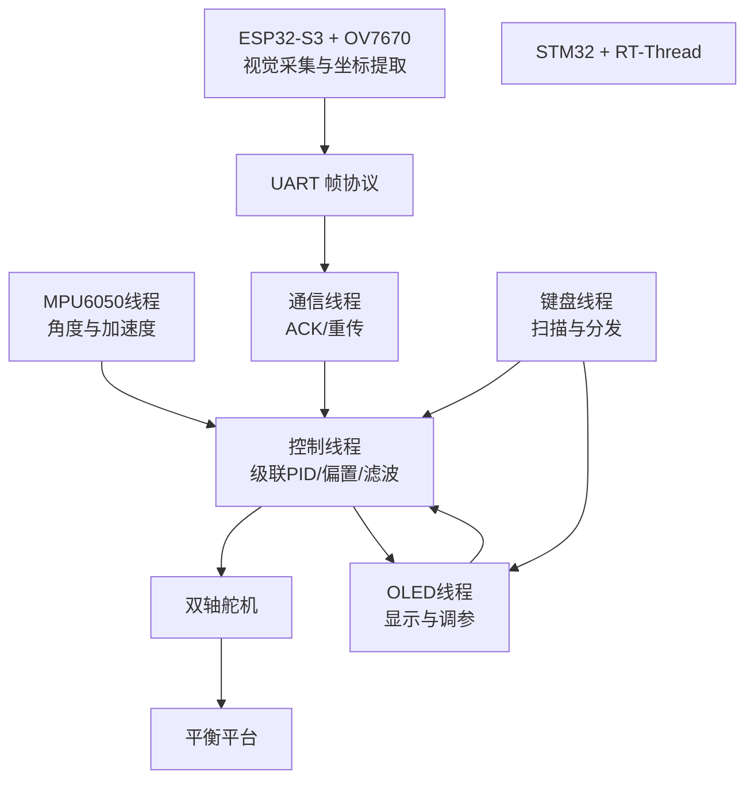
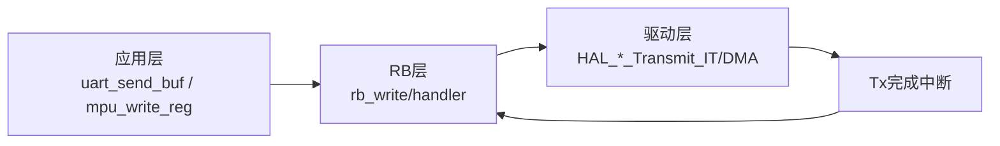
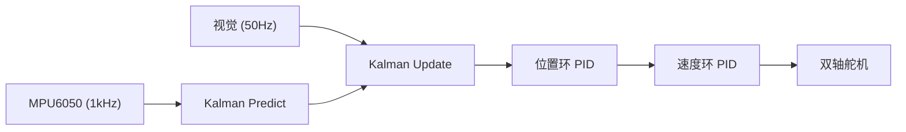
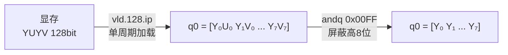
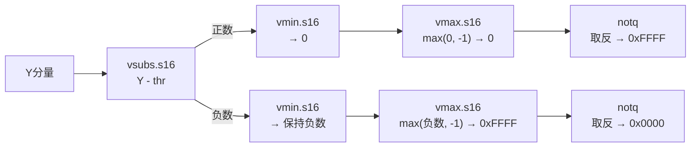
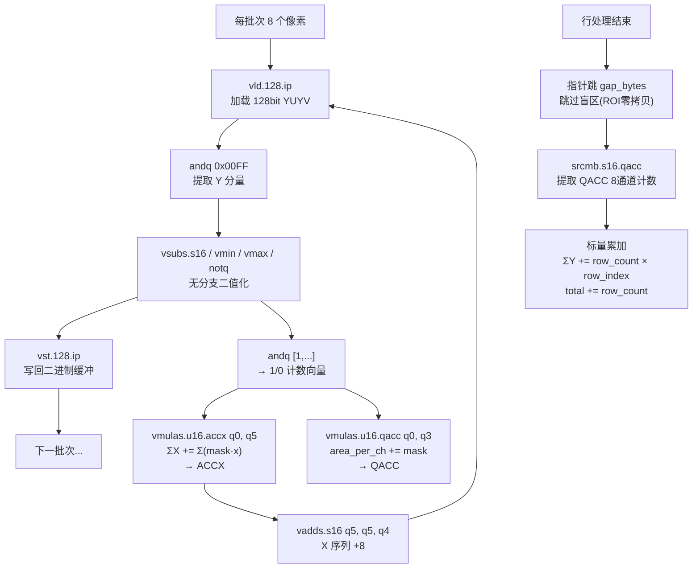
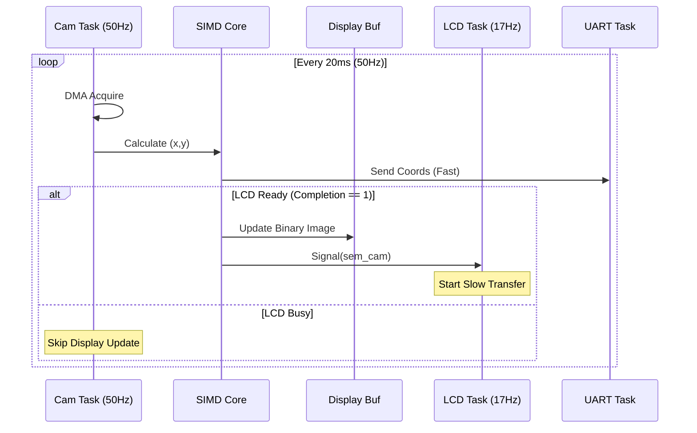

# 双核视觉球平衡控制系统 (RT-Thread + FreeRTOS)

本项目是一个基于 **STM32F1 (控制)** 与 **ESP32-S3 (视觉)** 双核异构架构的嵌入式球平衡系统。采用 **RT-Thread** 与 **FreeRTOS** 双实时操作系统协同工作，通过高频视觉闭环实现了对运动轨迹的动态跟踪与稳态平衡。

### 🚀 核心技术亮点
- **异构双核协同**：STM32 负责高实时性运动控制（级联 PID），ESP32-S3 负责高吞吐量视觉计算（SIMD 加速），通过自定义 **UART 帧协议 + ACK 重传机制** 保障通信可靠性。
- **高频视觉与 SIMD 加速**：基于 **Xtensa SIMD 指令集** 优化 YUV422 到二值化的图像处理流水线，在 **50FPS** 满帧率采集下，利用 **异步显存架构** 解决了 OV7670 高速写入与 ST7789 低速刷屏 (17FPS) 的带宽冲突。
- **高阶控制算法**：控制层采用 **位置环 + 速度环级联 PID**，结合 **MPU6050 互补滤波** 姿态解算与 **Kalman 滤波器** 融合编码器数据，实现了系统的抗干扰与稳态高精度。
- **工业级软件架构**：基于 **I/O 多路复用** 与 **RingBuffer** 实现的异步通信驱动，以及分层清晰的线程/任务模型。


---

## ✅ 实现功能

### 核心功能
- **小球平衡闭环控制**：二维位置环 + 速度环级联 PID，输出双轴舵机角度。
- **视觉位置输入**：通过 UART 与 ESP32-S3 通信，接收球心坐标 $`(x, y)`$ 及帧率信息。
- **姿态/加速度融合**：MPU6050 角度估计（互补滤波），可选位置 Kalman 预测更新。
- **偏置自动校准**：自动计算舵机中位偏置，稳定机械装配误差。

### 交互与显示
- **OLED 多页面菜单**：菜单页 / 调试页 / 传感器页 / ESP 信息页。
- **矩阵键盘交互**：切换页面、调整 PID、切换模式等。
- **串口调试输出**：支持速度、位置、角度等关键量观测。

---

## 🧩 系统架构

### 总体架构（数据流）

```mermaid
flowchart TB
	cam[ESP32-S3 + OV7670<br/>视觉采集与坐标提取]
	uart[UART 帧协议]
	stm[STM32 + RT-Thread]
	ctrl[控制线程<br/>级联PID/偏置/滤波]
	mpu[MPU6050线程<br/>角度与加速度]
	comm[通信线程<br/>ACK/重传]
	oled[OLED线程<br/>显示与调参]
	keypad[键盘线程<br/>扫描与分发]
	servo[双轴舵机]
	platform[平衡平台]

	cam --> uart --> comm --> ctrl --> servo --> platform
	mpu --> ctrl
	oled --> ctrl
	ctrl --> oled
	keypad --> ctrl
	keypad --> oled
```

### 分层设计
- **感知层**：MPU6050、视觉输入（ESP32）、编码器
- **控制层**：PID / Kalman / 状态机
- **执行层**：PWM 舵机驱动
- **交互层**：OLED + 矩阵按键
- **通信层**：UART 帧协议 + ACK 重发
- **驱动抽象层**：I2C/SPI/UART 统一 RB 队列 + IT/DMA 链式发送

---

## 📁 项目结构（核心部分）
```text
stm32_rtthread/
├─ _threads/
│  ├─ communicate_thread.c   # ESP32 通信与帧协议解析
│  ├─ keypad_thread.c        # 矩阵按键扫描与状态分发
│  ├─ mpu_thread.c           # MPU6050 姿态解算更新
│  ├─ oled_thread.c          # OLED 界面显示与交互
│  └─ servo_thread.c         # PID 控制与舵机输出
└─ applications/
   ├─ main.c                 # RT-Thread 入口
   ├─ drv_uart.c             # UART 帧收发驱动
   ├─ encoder.c              # 编码器读取
   ├─ kalman.c               # 位置 Kalman 预测/更新
   ├─ keypad.c               # 矩阵键盘底层驱动
   ├─ mpu6050.c              # I2C 读取与互补滤波
   ├─ mylib.c                # 核心控制算法与通用数学辅助库
   ├─ oled.c / oled_data.c   # OLED 屏幕驱动与字模
   ├─ ring_buff.c            # 环形缓冲区(RB)实现
   ├─ servo.c                # PWM 舵机驱动
   └─ shared_drive_init.c    # 外设统一初始化调度
├─ tools/
│  ├─ serial_monitor.py      # STM32 串口数据流监控与记录脚本
│  └─ data_analyze.py / plotter.py # 数据分析与波形绘制工具

esp32/
├─ camera_viewer.py          # ESP32 摄像头图像 PC 端预览与调试工具
├─ main/
│  ├─ main.c                 # FreeRTOS 任务启动与系统初始化
│  ├─ task/
│  │  ├─ cam_task.c          # 采集/二值化/质心计算
│  │  ├─ communicate_task.c  # UART 帧协议通信
│  │  ├─ lcd_task.c          # TFT 刷屏
│  │  └─ shell_task.c        # 命令行调试监控
│  └─ drivers/
│     ├─ drv_install.c       # 底层外设安装与初始化
│     ├─ drv_uart.c          # ESP32 UART 底层封装
│     ├─ my_ov7670.c         # OV7670 配置与初始化
│     ├─ tft.c               # ST7789 屏幕驱动
│     └─ config.h            # 全局宏开关
└─ CMakeLists.txt            # ESP-IDF 项目构建脚本
```

---

## 🧠 软件设计与实现

## 1) 线程与 IPC 设计

### STM32 部分（RT-Thread）

| 线程 | 文件 | 优先级 | 频率/触发 | 作用 | IPC / 同步机制 |
|---|---|---|---|---|---|
| `communicate_thread` | `_threads/communicate_thread.c` | 6 (较高) | 事件驱动 | 与 ESP32 通信，解析帧、ACK 重发、写入队列 | `rt_mq_t mq_xy` (Pro) |
| `servo_thread` | `_threads/servo_thread.c` | 7 (较高) | 消息驱动 | 位置/速度闭环控制 + 舵机输出 | 消费 `mq_xy`、`mb_mpu` (Con) |
| `mpu_thread` | `_threads/mpu_thread.c` | 15 (中) | 1kHz (1ms延时) | MPU6050 采样 + 角度计算 | `rt_mb_t mb_mpu` (Sync) |
| `keypad_thread` | `_threads/keypad_thread.c` | 18 (较低) | 50Hz (20ms延时) | 矩阵键盘扫描与去抖 | `rt_sem_release` (Signal) |
| `oled_thread` | `_threads/oled_thread.c` | 20 (较低) | 5Hz (200ms延时) | OLED 渲染 + 页面切换 | `rt_mb_t mb_to_oled` (Msg) |

### ESP32 部分（FreeRTOS）

| 任务 | 文件 | 优先级 | 频率/触发 | 作用 |
|---|---|---|---|---|
| `cam_task` | `main/task/cam_task.c` | 21 (高) | 50Hz (摄像头驱动) | 采集图像、二值化/裁剪、质心计算、发送坐标 |
| `communicate_task` | `main/task/communicate_task.c` | 20 (中高) | 消息驱动 | UART 帧协议发送坐标/帧率 |
| `lcd_task` | `main/task/lcd_task.c` | 19 (中) | 信号量驱动 | 将二值图像输出到 TFT，统计显示帧率 |
| `shell_task` | `main/task/shell_task.c` | 5 (低) | 命令行输入驱动 | USB-JTAG 监控 shell（任务、堆栈、内存） |

#### 关键同步与互斥设计
1. **STM32 外设互斥**：
   - I2C 总线（`my_hi2c1`）同挂载了 MPU6050 与 OLED。
   - 在 `shared_drive_init.c` 中，底层驱动使用 `rt_sem_take/release`  保护 I2C 读写操作，防止 MPU6050 高频读取打断 OLED 耗时刷新，导致总线仲裁丢失。
2. **ESP32 跨任务同步**：
   - **`sem_cam` (Binary Sem)**：`cam_task` 完成一帧图像二值化后释放信号量，唤醒 `lcd_task` 进行刷屏。
   - **`Completion` (Volatile Flag)**：简单的标志位，防止 `cam_task` 覆盖尚未刷屏显存。
3. **ESP32 数据流同步**：
   - **`xMailbox` (Queue)**：多对一模型，`cam_task`（坐标/FPS）与 `lcd_task`（显示FPS）均向此队列投递消息，`communicate_task` 统一取出并通过 UART 发送，避免了多任务直接操作 UART 的竞态。

---

### 2) 通信协议设计（STM32 ↔ ESP32）

STM32（控制端）与 ESP32-S3（视觉端）之间通过 UART 双向通信。为在 50Hz 高频视觉数据下保障链路可靠性，设计了一套**对称式轻量帧协议**——两端发送与接收逻辑完全镜像（`send_to_esp` ↔ `send_to_stm`、`listen_to_esp` ↔ `listen_to_stm`），包含帧校验、SEQ 去重、ACK 确认与超时重传机制。

#### 2.1 帧结构

```
 0xAA 0xBB  |  SEQ (1B)  |  LEN (1B)  |  PAYLOAD (变长)  |  CRC8 (1B)
 ── 帧头 ──   ─ 序号 ──   ─ 长度 ──      ──    数据    ──   ─ 校验 ─
```

| 字段 | 长度 | 说明 |
|------|------|------|
| `0xAA 0xBB` | 2B | 帧头标记，用于字节流中的帧同步 |
| SEQ | 1B | 序列号，发送端每成功发送一帧后递增；用于接收端去重与 ACK 确认 |
| LEN | 1B | 后跟 PAYLOAD 的字节长度（最大 27），支持变长数据 |
| PAYLOAD | 变长 | 数据载荷，首字节为 Type（见 2.5），后续为具体数据 |
| CRC8 | 1B | 从 SEQ 到 PAYLOAD 结束的 CRC-8 校验（多项式 0x31） |

#### 2.2 发送流程（Stop-and-Wait ARQ）

发送端采用经典的**停止-等待自动重传请求**：

```
组装帧 → 发送 → 等待 ACK (5ms 超时) → 收到正确 ACK → SEQ 递增
                                      → 超时/错误 → 重发 (最多尝试 timeout_ms/5 次)
```

关键机制：
- **ACK 匹配**：接收端回复的 ACK 字节即为该帧的 SEQ，发送端校验其与当前 `tx_seq` 一致才确认成功。
- **重试上限**：达到最大重试次数后退出，防止 UART 死锁。典型超时配置为 1000ms，即最多重试 200 次。
- **两端对称**：STM32 和 ESP32 均可用此函数向对方发送数据（实际项目中 ESP32 单向发送球坐标、STM32 暂未使用下行通道）。

#### 2.3 接收流程（状态机解析）

接收端按**四阶段状态机**逐级解析帧，解析失败即退出，状态机从头重试下一帧：

```
 WAIT_HEAD → CHECK_SEQ → WAIT_PAYLOAD → VERIFY_CRC → 成功
```

| 阶段 | 动作 | 失败处理 |
|------|------|----------|
| **① WAIT_HEAD** | 逐字节读取，匹配 `0xAA 0xBB` | 任一字节不匹配立即退出，从头重试 |
| **② CHECK_SEQ** | 读取 SEQ，与上次 `rx_seq` 比较 | 若与 `rx_seq` 相同→判为重复帧→**回复 ACK + 清空 RingBuffer** + 丢弃数据→退出 |
| **③ WAIT_PAYLOAD** | 读取 LEN，再读 LEN 字节的 PAYLOAD | 数据超长则报错退出 |
| **④ VERIFY_CRC** | 读取末尾 CRC8 字节，本地重算比对 | CRC 不一致→不回复 ACK→触发发送端超时重传 |

**ACK 回复规则**：仅当帧解析成功（④通过）或检测到重复 SEQ（②命中）时回复 ACK；其余错误均不回复 ACK，发送端因等待超时而自动重发，实现可靠的隐式错误恢复。


#### 2.4 错误恢复机制

| 异常场景 | 表现 | 恢复方式 |
|----------|------|----------|
| **帧头错位** | 接收端无法匹配 `0xAA 0xBB` | 接收端逐字节滑动直到重新同步；发送端未收到 ACK 会超时重发 |
| **CRC 损坏** | 接收端 CRC 比对失败 | 不回复 ACK，发送端超时重传 |
| **ACK 丢失** | 发送端已发完帧但未收到 ACK | 超时后重发同样 SEQ 的帧 |
| **重复帧** | 接收端 SEQ 与上次相同（ACK 丢失导致的重传） | 丢弃数据不进队列，补发一次 ACK 解开发送端的阻塞等待 |
| **RingBuffer 脏数据** | 差错期间 UART 缓冲区堆积了重传产生的脏帧 | 重复 SEQ 检测命中时执行 `uart_rx_buf_clear()` 清空缓冲区，防止残留数据干扰后续帧同步 |

#### 2.5 数据载荷类型

PAYLOAD 首字节为 Type 字段，用于区分不同数据通道：

| Type | 数据内容 | 长度 | 发送方 | 流向 |
|------|----------|------|--------|------|
| `0x01` | 摄像帧率 `cam_fps` | 5B（1B Type + 4B float） | ESP32 `cam_task` | → OLED 显示 |
| `0x02` | 球坐标 `(x, y)` | 9B（1B Type + 8B float×2） | ESP32 `cam_task` | → `mq_xy` 消息队列 → 控制线程 |
| `0x03` | 显示帧率 `lcd_fps` | 5B（1B Type + 4B float） | ESP32 `lcd_task` | → OLED 显示 |

**关键设计**：三种类型的数据统一经过 `xMailbox` 队列送入 `communicate_task` 串行发送，避免多任务直接竞争 UART 硬件。

---

## STM32 控制侧

**功能概述**：
作为系统的运动控制中枢，STM32 依托 RT-Thread 实时操作系统，构建了高实时性、强解耦的感知与执行任务栈。其核心职责涵盖：持续接收并解包 ESP32 下发的视觉位置帧；高频采集 MPU6050 姿态数据；运行基于 `位置+速度` 级联 PID 与 Kalman 滤波的核心控制律；并最终转化为平滑精准的 PWM 信号输出驱动平台舵机。此外，该端还统筹管理并实现了零阻塞的 OLED 人机交互面板与在线参数整定功能。

### 1) 异步链式发送与驱动解耦

该工程的 I2C/SPI/UART 都使用 **统一的环形缓冲区 (RB) + 回调链式发送**，实现“上层无感知的异步输出”，核心实现在：
- `applications/ring_buff.c/.h`
- `applications/shared_drive_init.c`

#### 设计目标
- **应用层无阻塞**：上层只需要 `uart_send_buf()` / `mpu_write_reg()`，不关心底层是 IT 还是 DMA。
- **多线程并发安全**：RB 结构底层内置了互斥锁 (`rt_mutex`) 保护。无论是调用 I2C、SPI 还是 UART 的输出层，都天然支持多线程乱序高频并发写入，保障了公共总线数据在被封装塞入环形缓冲区时的线程安全。
- **驱动层解耦**：I2C/SPI/UART 统一由 RB 抽象，设备与协议可复用。
- **链式发送**：上一帧完成后自动发送下一帧，不需要显式调度。

#### 核心机制（以 UART 为例）
1. **上层写入 RB (处理回绕)**：
	- `uart_send_buf()` → `rb_write()`
	- **自动分段**：当数据跨越缓冲区尾部时，`rb_write` 自动执行 **两次 `memcpy`**（一段填满尾部，剩余写入头部），向上层屏蔽物理内存环形结构。
2. **RB 触发链式发送**：
	- 当 `rb->isfree` 为 1 时立即触发 `rb->data_handler()`
3. **发送完成回调继续取帧**：
	- `HAL_UART_TxCpltCallback()` → `rb_ITcallback()` → `rb_uartX_handler()`
4. **驱动层按 frame_head 的 mode 自动选择 IT/DMA**

#### 抽象层解耦示意

```mermaid
flowchart LR
	app[应用层<br/>uart_send_buf / mpu_write_reg] --> rb[RB层<br/>rb_write/handler]
	rb --> hal[驱动层<br/>HAL_*_Transmit_IT/DMA]
	hal --> isr[Tx完成中断]
	isr --> rb
```

该结构对 I2C/SPI/UART 均通用，**设备只需填充 `frame_head_t.device` 即可复用**。

---

### 2) 控制策略设计

控制主逻辑位于 `_threads/servo_thread.c`，由两条异步数据流共同驱动：MPU 数据流（邮箱 `mb_mpu`，约 1kHz）和视觉数据流（消息队列 `mq_xy`，约 50Hz）。二者在 `servo_thread` 中被非阻塞地分别消费，互不阻塞。

#### 控制流程图 (含 Kalman 信号流)

```mermaid
flowchart LR
    mpu["MPU6050 (1kHz)"] --> pred["Kalman Predict"]
    vis["视觉 (50Hz)"] --> upd["Kalman Update"]
    pred --> upd  --> pos["位置环 PID"]
    pos --> spd["速度环 PID"] --> servo["双轴舵机"]
```

#### 2.1 位置-速度状态估计：Kalman 滤波器

文件：`applications/kalman.c`，实现一个位置-速度二阶 Kalman 滤波器，核心设计在于将 **Predict** 和 **Update** 两个步骤解耦到不同的异步数据流中执行。

**状态向量与运动模型**：状态为 $`x = [pos,\; vel]^T`$，采用匀加速运动模型，加速度 $`a`$ 作为控制输入，来源于 MPU6050 平台倾斜角换算的重力分量 $`a = g \cdot \sin(\theta)`$。

**Predict（MPU 数据到达时 ≈ 1kHz）**：每次收到 MPU 数据，按以下公式外推状态：

$` \hat{x}_{k|k-1} = F \hat{x}_{k-1} + B a_{imu} `$

其中 $`F = \begin{bmatrix} 1 & dt \\ 0 & 1 \end{bmatrix}`$，$`B = \begin{bmatrix} \frac{1}{2}dt^2 \\ dt \end{bmatrix}`$；同时预测协方差：

$` P_{k|k-1} = F P_{k-1} F^T + Q `$

矩阵运算手工展开以避免数值库依赖。

**Update（视觉坐标到达时 ≈ 50Hz）**：当新的位置测量 $`z_k`$ 到达时，首先计算新息（测量残差），即实测位置与预测位置的偏差：

$` y_k = z_k - H \hat{x}_{k|k-1}, \\quad H = [1, 0] `$

然后计算新息协方差，用于衡量测量值的不确定度：

$` S_k = H P_{k|k-1} H^T + R `$

由此得到 Kalman 增益——它决定了预测和测量之间的信任权重分配：

$` K_k = P_{k|k-1} H^T S_k^{-1} `$

用增益加权修正先验状态，得到后验状态估计：

$` \hat{x}_k = \hat{x}_{k|k-1} + K_k y_k `$

最后更新协方差矩阵，降低后验不确定性：

$` P_k = (I - K_k H) P_{k|k-1} `$

因 $`H=[1,0]`$，Kalman 增益退化为标量，通过交叉协方差项 $`P[1][0]`$ 从位置残差中推断速度修正。

**速度估计的核心优势**：不依赖位置差分（会放大噪声），而是通过协方差矩阵交叉项和 Kalman 增益，在测量噪声 $`\sigma_R`$ 与过程噪声 $`\sigma_Q`$ 之间自动寻求最优权衡，输出速度序列比差分法平滑一个数量级。

**上球初始化**：视觉从无球检测到有球的首帧时刻，Kalman 状态被重置——协方差矩阵恢复为单位阵，位置初始化为首帧测量值，速度初始化为零。这避免了滤波器因上球瞬间状态突变而产生较大动态偏差。

**关键参数**：`kalman_q`（位置过程噪声强度，典型值 0.002）决定滤波器对测量值的信任程度——越大则响应越快但平滑度下降；`kalman_r`（测量噪声方差，典型值 0.5）反映视觉坐标的预期噪声水平；速度过程噪声取位置噪声的 10 倍，反映速度变化较位置快一个数量级的物理直觉。未定义 `USE_KALMAN_FILTER` 时系统退化为纯位置差分。

#### 2.2 级联 PID（位置环 + 速度环）

基于 Kalman 输出（或退化模式下的直接测量）的平滑位置和速度，系统执行位置-速度级联 PID 控制，使小球稳定在画面中心。

**外环：位置环** — 输入为当前位置（Kalman 滤波后的平滑值），输出为目标速度。比例项引导小球向目标位置运动，微分项感知位置变化率提供阻尼，积分项消除稳态误差。

**内环：速度环** — 输入为当前速度（Kalman 滤波后的平滑值），输出为舵机角度。比例项驱动速度跟踪外环给定的目标速度，微分项提供阻尼。

**Derivative-on-Measurement（微分在测量值上）**：两个环的微分项均计算在测量值而非误差上。这避免了目标值阶跃变化时的微分冲击（Derivative Kick），同时由于测量值本身经 Kalman 平滑，微分项引入的噪声远小于传统设计。

**积分分离与抗饱和**：内环在偏置校准模式下启用积分（`integral_range = 2.0`），仅当速度误差较小时累积积分，避免大动态过程中积分饱和。积分项带有对称限幅，防止 windup 现象导致的超调。正常平衡模式时速度环积分项置零，稳态精度由位置环保证。

**X/Y 轴参数差异**：两轴采用不同的积分系数（Y 轴 ki 略小），反映因舵机安装不对称和重力方向分量差异导致的机械特性不同。

#### 2.3 控制时序与双模式状态机

**完整时序**：servo_thread 的每个循环周期内，以非阻塞方式轮询三个 IPC 源：

- **MPU 消息**（邮箱，0 等待）：收到 → 执行 Kalman Predict
- **视觉消息**（消息队列，100ms 超时）：收到 → 执行 Kalman Update → 执行级联 PID → 输出舵机角度
- **按键消息**（邮箱，0 等待）：收到 → 切换工作模式或调整参数

**两种工作模式**：

- **正常平衡模式**：Kalman + 级联 PID 全链路运行。视觉丢球检测（坐标 -1）时自动回到舵机偏置角度，等待下一次上球。
- **偏置校准模式**：启用速度环积分，通过缓慢的位置控制使球趋于静止；当速度连续低于阈值持续足够长时间后，记录当前舵机角度为机械偏置量，用于补偿装配误差。

#### 2.4 角度估计（互补滤波）
文件：`applications/mpu6050.c`

采用经典互补滤波融合陀螺仪和加速度计：高频域信任陀螺仪积分的平滑角速度，低频域利用加速度计修正陀螺仪漂移。当前参数 α=0.98（高度信任陀螺仪），输出用于两方面——作为 Kalman Predict 的加速度输入源（通过倾斜角换算重力分量），以及供 OLED 实时显示姿态角。

---

### 3) 舵机驱动与编码器

#### 3.1 舵机驱动（PWM）
文件：`applications/servo.c`
- **定时器 PWM 输出：** 使用硬件定时器产生 50Hz (20ms 周期的) 标准 PWM 脉冲，驱动双轴数字舵机。
- **角度平滑映射算法：** 舵机物理受控范围对应 0.5ms~2.5ms 脉宽。控制层将级联 PID 算出的带符号位姿角度 $`[-90^\circ, +90^\circ]`$ 平移缩放并安全限幅，线性映射为 $`[0^\circ, 180^\circ]`$ 后写入底层比较寄存器。
- **安全启停与保护机制：** 提供独立的物理使能封装。当按键切出测试模式、执行标定或发生严重掉包时，强制切断 PWM 输出波形，使舵机掉电卸力，防止平台因为残流乱动。

#### 3.2 编码器输入
文件：`applications/encoder.c`
- **硬件正交解码：** 将旋转编码器挂载至硬件定时器的正交解码模式 (`Encoder Mode`)，利用 A/B 两相双沿带来的 4 倍频特性，极大增强旋钮微调的细分分辨率。
- **抗噪稳健机制：** 在开启定时器内部硬件输入滤波消除高频电平毛刺的基础上，通过软件防抖将硬件计数值进行降维步进处理。
- **业务层接口解耦：** 向上层业务提供净化后的“转一格记一次”归一化增减量，使得各界面的菜单翻阅与 PID 数值调整逻辑与底层硬件噪声彻底隔离。

---

### 4) OLED 与按键交互

OLED 与键盘并不是"直接改全局变量"的粗耦合设计，而是通过**页面状态 + 按键事件 + 邮箱消息**实现线程解耦。

#### 4.1 页面职责划分
- **menu 页面（运行总览）**
   - 显示：姿态角、CPU 占用、平台开关状态（`test_mode`）
   - 作用：运行时总览与安全启停入口
- **debug 页面（在线调参）**
   - 显示/编辑：位置环或速度环 PID 参数（p/i/d）
   - 作用：不重编译固件即可在线微调控制器参数
- **mpu_data 页面（传感观测）**
   - 显示：加速度、温度、角度相关原始/中间量
   - 作用：快速判断传感器是否漂移、抖动或异常
- **esp_info 页面（视觉链路监控）**
   - 显示：视觉 FPS、坐标 $`(x,y)`$
   - 作用：辅助判断“控制抖动”来自视觉端还是控制端

#### 4.2 交互开关说明

- **`test_mode`（平台开关/安全门）**
   - 打开时允许控制输出进入舵机 PWM，关闭时立即切断舵机输出
   - 用于硬件联调、传感器校验、串口观测时防止平台误动作
   - 在 `menu` 页面按 `KEY_OK` 切换

- **`set_offset_mode`（偏置标定/零点校准）**
   - 用于消除机械装配误差，使舵机"理论零点"更接近真实水平位置
   - 触发后系统进入偏置求解流程：当平台静止（球几乎不动）时，记录此时舵机保持平台水平所需的驱动角度作为偏置量
   - 实现流程：启用速度环 PID 积分项 -> 低速位置控制使球趋近中心 -> 检测速度连续低于阈值 -> 记录偏置量并重置 PID -> 退出时关闭积分项，偏置叠加到常规输出
   - 在 `debug` 页面按 `KEY_OK` 进入/退出

- **`debug_mode`（调参模式/在线参数整定）**
   - 与 OLED 调试页联动，允许对 PID 参数进行增减
   - 调参期间参数更新以事件驱动方式生效，避免主循环阻塞
   - 常与 `test_mode` 组合使用：先关平台调参，再开平台验证响应
   - 通过 `debug` 页面的方向键和确认键操作

- **`data_analysis_mode`（数据分析模式）**
   - 调试开关，用于将系统运行数据通过 UART 上传给 PC 端进行分析和可视化
   - 数据帧以 `0xAA 0xAA` 为帧头，后跟 8 个浮点数依次为目标速度X/Y、实际速度X/Y、球坐标X/Y、舵机角度X/Y
   - 使用配套 Python 脚本接收并绘制波形，可观察：目标速度与实际速度的跟踪误差、位置响应曲线、舵机输出角度等
   - 在 `mpu_data` 页面按 `KEY_OK` 切换

#### 4.3 按键事件分发机制

不同页面状态下，同一按键事件会触发完全不同的响应，这种设计通过**状态分支 + 消息邮箱**实现：

1. **按键线程 (`keypad_thread`)**：扫描矩阵键盘并进行去抖处理，将原始键值通过邮箱同时发送给 `oled_thread` 和 `servo_thread`；
2. **OLED 线程 (`oled_thread`)**：根据 `oled_state` 当前状态对按键消息进行分支响应：
   - **页面切换按键** (`KEY_PGUP`/`KEY_PGDN`)：在所有页面均可触发，实现循环切换；
   - **方向键与确认键**：仅在特定页面有响应。

**各页面按键响应行为：**

| 页面 | 按键 | 响应功能 |
|------|------|----------|
| `menu` | `KEY_OK` | 切换 `test_mode`（平台启停），控制舵机使能/失能 |
| `debug` | `KEY_UP/DOWN` | 切换光标位置（选择要修改的参数：p/i/d） |
| `debug` | `KEY_LEFT/RIGHT` | 移动小数位光标，实现精细调参 |
| `debug` | `KEY_OK` | 切换 `set_offset_mode`（进入/退出偏置校准模式） |
| `mpu_data` | `KEY_OK` | 切换 `data_analysis_mode`（开启/关闭数据上传分析模式） |

**按键消息处理流程：** OLED 线程首先检查是否为页面切换按键（`KEY_PGUP`/`KEY_PGDN`），这类按键在所有页面均可响应，执行循环切换逻辑。然后根据当前页面状态判断是否有对应的按键响应——例如仅在 `debug` 页面响应方向键调参操作，仅在 `mpu_data` 页面响应 `KEY_OK` 切换数据分析模式。

#### 4.4 按键扫描与去抖
矩阵键盘采用“**周期扫描 + 状态机去抖**”策略，核心流程如下：
1. `keypad_thread` 以固定周期扫描行列引脚，得到原始按键值；
2. 去抖状态机对按下/释放边沿做稳定计数，过滤机械抖动；
3. 仅在确认“稳定按下/稳定释放”后生成逻辑事件（短按、连续调整等）；
4. 事件通过邮箱/消息机制分发给 `oled_thread` 与 `servo_thread`，避免多线程直接抢占同一控制变量。

这种设计把“硬件抖动”与“业务语义”分层处理，优势是：
- OLED 刷新周期较慢也不会漏关键操作；
- 控制线程只消费**已去抖**事件，降低误触发风险；
- 输入设备可替换（如编码器旋钮）而不破坏上层状态逻辑。

#### 4.5 线程协作关系
从用户按键到系统行为的路径可概括为：

`矩阵键盘 -> keypad_thread(扫描/去抖) -> 邮箱消息 -> oled_thread(页面与参数显示) / servo_thread(模式切换与控制生效)`

即：
- **显示相关事件**由 OLED 线程处理（页面跳转、光标项变化、数值可视化）；
- **控制相关事件**由控制线程处理（开关平台、偏置标定、调参生效）。

这样能保证“显示不卡控制，控制不阻塞采样”。

---

## ESP32 视觉侧

**功能概述**：
作为系统的视觉感知中枢，ESP32-S3 基于 FreeRTOS 实时操作系统处理高吞吐量的图像数据流。其核心任务是直接操控摄像头硬件完成稳定的 50FPS 原始图像采集，并在严格的时限内，利用定制的手写 TIE SIMD 汇编指令进行极速并行的“单遍二值化与质心标定”。剥离多余的处理负担，以最低的计算延迟将其转换为标准化目标坐标 $`(x,y)`$ 并经由帧协议加密下发给下游的 STM32 侧，为整套系统提供高频、稳健的视觉闭环反馈数据。

### 1) 图像处理与坐标提取

#### 1.1 总体视觉策略
本系统的视觉核心目标是**以极低的计算延迟与满帧率(50Hz)稳定提取小球坐标**，并通过串口发送至stm32端。
为此，本项目摒弃了缓慢的边缘轮廓检测、霍夫圆寻找乃至复杂的 HSV 色彩空间分割，而是采用**“高对比度物理设定 + 极速亮度二值化 + 直接统计图像一阶矩找质心”**的极简稳健算法。
- **物理先验**：假定平衡台底板与小球本身呈现天然的明显明暗反差（如白色面板上的深色球），并在代码中给定亮度分层分界线（`THRESHOLD = 180`）。
- **极速提取**：基于上述规律，仅需对整幅显存区域进行**单遍线性扫描（Single-pass）**，在筛出目标像素的同时并行累加几何重心坐标 $`(x_c, y_c)`$。
- **天然访存优势**：此算法的内存访问极致规律，使得从标量处理平滑过渡到下文的 Xtensa SIMD 向量化并行加速成为可能。

#### 1.2 摄像头驱动与硬件级修正
文件：`main/drivers/my_ov7670.c` 与 `main/task/cam_task.c`
- **SCCB 硬件复位时序修复**：由于大量旧款 OV7670 上电慢且时序挑剔，直接调用官方 `esp_camera_init()` 会极大概率导致 SCCB 总线读不出 Sensor ID (`0x7673`) 而挂机。系统主动利用 GPIO 强行接管时序：拉低 `PWDN` (唤醒) -> 拉低 `RESET` -> 延时 100ms 彻底放电复位 -> 拉高 `RESET` 等待 100ms。确保传感器内部逻辑就绪后再交还驱动初始化。
- **流水线预热 (Warm-up)**：在正式进入追踪死循环前，会单独且无处理地拉取 5 帧弃用图像。给摄像头的硬件自动曝光 (AEC) 及白平衡系统留出控制建立时间的重算窗口，确保初始给到 PID 的数据即是亮度和色彩稳定的。
- **原生格式利用**：采用原生 `YUV422` 图像输出而非耗时的 RGB 转换，直接利用 `Y` 分量实现高速灰度读取。

#### 1.3 多任务处理流水线 (Pipeline)
处理流水线紧密结合了 FreeRTOS 队列硬件机制：
1. **帧捕获**：通过 `esp_camera_fb_get` 获取 DMA 帧。
2. **高聚合 ROI 裁剪 + 二值化 + 质心计算**：调用核心函数 `yuyv_to_binary_simd_with_cal_core`，通过参数 `(x=0, y=0, width=248, height=240, raw_width)` 指定关注视野，利用指针跳步（`gap_bytes`）跳过每行末尾像素实现**零拷贝 ROI 裁剪**，屏蔽无效的台面边缘和环境光干扰，优化计算开销。单次 SIMD 遍历显存过程中**同时完成**光线阈值黑/白比较、有效像素数量累加（计算 Area 面积）与 $X/Y$ 坐标的矩特征累加。
3. **坐标封装机制**：得到质心坐标 $`(cx, cy)`$ 后，组装成 9 字节的数据包，首字节加入 Type 特征符 `buf[0] = 2` 代表物理坐标指令，后附两组 `4字节` 浮点底层串。
4. **异步安全投递**：将生成包以超短的 `10 ticks` 阻塞限度投递至多对一队列池 `xMailbox` (`xQueueSend`)，等待 `communicate_task` 取出、加添 CRC 包头尾并压进 UART 发往 STM32 主控。

### 2) SIMD 加速设计
在 `cam_task.c` 中，针对“每帧都要做二值化 + 质心统计”这条热点路径，采用 **ESP32-S3 专属的 TIE（Tensilica Instruction Extension）SIMD 指令集**进行专门优化。
*注：这些指令（如 128-bit 向量寄存器 `q0-q7`、`ACCX` 等）并非 Xtensa 基础架构自带，而是 Espressif 针对图像/AI处理向底层定制的加速扩展。*
由于标准的 GCC 编译器在编译期**无法自动生成这些客制化的底层 SIMD 指令**，且乐鑫官方提供的 esp-dsp 或 esp-nn 等官方库也**完全没有提供能一次性完成“掩码判断 + 几何矩计算”的复合功能 API**。因此，要榨干芯片在此流水线上的运算潜力，只能依靠**纯手写内联汇编 (Inline Assembly) 从零搭建**。


#### 2.1 目标
- 原始标量流程需要逐像素执行：读取 YUV → 阈值判断 → 生成二值位 → 统计面积与一阶矩。
- 在 50FPS 采集目标下，原始标量流程**无法达到 50Hz**，会长期占用 CPU 并挤压 UART 与 LCD 任务时间片，导致帧率下滑与系统抖动。
- 因此把“同构、可并行”的像素处理段抽出，作为 SIMD 专项优化对象。

#### 2.2 向量化主路径与核心指令

在 `asm volatile` 内联汇编块中，核心计算被彻底重构以压榨底层算力。以下逐条分析每一条核心指令的语义与作用（设阈值为 180，处理 8 个像素的 Y 通道）：

**寄存器分配约定：**
- `q0`：当前批次 8 个 16-bit YUYV 像素（低 8 位为 Y，高 8 位为 UV）
- `q1`：阈值向量 `[180, 180, …, 180]`
- `q2`：掩码向量 `[0x00FF, 0x00FF, …, 0x00FF]`（提取 Y 分量用）
- `q3`：全 1 向量 `[1, 1, …, 1]`（用于计数）
- `q4`：常数向量 `[8, 8, …, 8]`（X 坐标递增步长）
- `q5`：当前批次 X 坐标序列 `[x, x+1, …, x+7]`
- `q6`：`[0xFFFF, 0xFFFF, …, 0xFFFF]`（有符号即 -1）
- `q7`：`[0x0000, 0x0000, …, 0x0000]`（0）

##### ① 并行加载与 Y 通道提取

```asm
ee.vld.128.ip q0, %[in], 16      // 加载 128bit = 8 个 YUYV 像素，ptr += 16
ee.andq       q0, q0, q2         // q0 &= 0x00FF → 仅保留低 8 位 Y 分量
```

`vld.128.ip` 在单周期内从显存加载 128bit 原始像素数据到向量寄存器，同时指针自动后移 16 字节准备下一批。随后 `andq` 利用预设的 `0x00FF` 掩码屏蔽高 8 位 UV 色度分量，`q0` 变为 `[Y₀, Y₁, …, Y₇]`。


```mermaid
flowchart LR
    MEM["显存<br/>YUYV 128bit"] -->|"vld.128.ip<br/>单周期加载"| RAW["q0 = [Y₀U₀ Y₁V₀ ... Y₇V₇]"]
    RAW -->|"andq 0x00FF<br/>屏蔽高8位"| Y["q0 = [Y₀ Y₁ ... Y₇]"]
```

##### ② 无分支阈值比较（核心技巧，4 条指令）

```asm
ee.vsubs.s16 q0, q0, q1    // q0 = Y - thr  (有符号饱和减法)
ee.vmin.s16   q0, q0, q7   // q0 = min(q0, 0)        — 正数归零
ee.vmax.s16   q0, q0, q6   // q0 = max(q0, -1)       — 负数归 -1(0xFFFF)
ee.notq       q0, q0       // q0 = ~q0                — 按位取反
```

这四条指令用**有符号饱和算术**替代了传统的 `if(Y >= thr)` 条件分支，以下是两个像素的逐级推导：

| 步骤 | 操作 | Y=200 (≥thr, 应判白色) | Y=100 (<thr, 应判黑色) |
|------|------|:---:|:---:|
| `vsubs.s16` | `Y - 180`（有符号饱和） | `+20`（正数） | `-80`（负数） |
| `vmin.s16` | `min(…, 0)` | `0`（正数归 0） | `-80`（负数保持） |
| `vmax.s16` | `max(…, -1=0xFFFF)` | `0`（`max(0,-1)=0`） | `0xFFFF`（负数变 -1） |
| `notq` | 按位取反 | `0xFFFF` **白色** | `0x0000` **黑色** |

最终：**Y ≥ thr → 0xFFFF（目标）**，**Y < thr → 0x0000（背景）**。整个过程未使用任何分支指令（`bnez`/`bge` 等），CPU 流水线永不因分支预测失败而冲刷。


```mermaid
flowchart LR
        direction LR
        Y["Y分量"] --> SUB["vsubs.s16<br/>Y - thr"]
        SUB -->|"正数"| CLIP1["vmin.s16<br/>→ 0"]
        SUB -->|"负数"| CLIP2["vmin.s16<br/>→ 保持负数"]
        CLIP1 --> CLIP3["vmax.s16<br/>max(0, -1) → 0"]
        CLIP2 --> CLIP4["vmax.s16<br/>max(负数, -1) → 0xFFFF"]
        CLIP3 --> NOT1["notq<br/>取反 → 0xFFFF"]
        CLIP4 --> NOT2["notq<br/>取反 → 0x0000"]
```

##### ③ 写回与转计数

```asm
ee.vst.128.ip q0, %[out], 16        // 128bit 二值化结果写回 binary 缓冲区
ee.andq       q0, q0, q3            // 0xFFFF & 1 = 1, 0x0000 & 1 = 0 → 计数向量
```

`vst.128.ip` 一次性写回 8 个像素的二值结果（每个 16-bit）。`andq [1,1,…]` 将 `0xFFFF`/`0x0000` 归一化为 1/0 计数值，供后续累加指令消费。

##### ④ 单遍重心累加（ACCX + QACC 协作）

```asm
ee.vmulas.u16.accx q0, q5       // ΣX += Σ(mask[i] × x_coord[i])  → 40-bit ACCX
ee.vmulas.u16.qacc q0, q3       // area_per_channel[i] += mask[i] × 1  → QACC
ee.vadds.s16     q5, q5, q4     // X 坐标序列 +8，准备下一批次
```

这是最精妙的硬件统筹设计。由于 ESP32-S3 SIMD 只有一个标量硬件累加器 `ACCX`（40-bit），无法同时累加 ΣX 和面积，设计上做了如下分工：

- **ACCX 负责 ΣX（点积）**：`vmulas.u16.accx` 将掩码向量 `q0`（0/1）与 X 坐标向量 `q5` 做点积，结果累入唯一的 ACCX。`q5` 每批次通过 `vadds.s16 q5, q5, q4` 递增 8，始终持有当前 8 个像素的正确 X 坐标。
- **QACC 负责面积（按通道累加）**：`vmulas.u16.qacc` 将掩码 `q0` 与全 1 向量 `q3` 做**逐元素乘法**（相当于 MATLAB 的 `.*`），结果按通道独立暂存在 QACC 的 8 个 32-bit 内部槽位中。行尾通过 `srcmb.s16.qacc` 一次性取出，求和得到该行目标像素总数。

这种"主副累加器协流"的设计，使得单遍 SIMD 遍历中**同时完成 ΣX 和面积两个值的累加**，无需拆分两次循环。

##### ⑤ 行尾 Y 坐标累加

```asm
ee.srcmb.s16.qacc q5, a13, 0     // 提取 QACC 低 16 位到 q5
ee.vst.128.ip     q5, %[res], 0  // q5 → 内存临时区
```
然后标量代码累加 8 个通道的值得到行目标总数 `row_count`：

```asm
mull a9, a8, a14       // a9 = row_count × 当前行号 Y
add a11, a11, a9       // total_sum_y += a9
add a12, a12, a8       // total_count += row_count
```

**不用 SIMD 加速 Y 的原因**：同一行内所有像素的 Y 坐标相同，无需向量化。仅需统计本行目标像素总数，乘以行号 Y 即可。

##### ⑥ 完整单遍流水线


```mermaid
flowchart TD
    START["每批次 8 个像素"] --> LOAD["vld.128.ip<br/>加载 128bit YUYV"]
    LOAD --> MASK["andq 0x00FF<br/>提取 Y 分量"]
    MASK --> THRESH["vsubs.s16 / vmin / vmax / notq<br/>无分支二值化"]
    THRESH --> WRITE["vst.128.ip<br/>写回二进制缓冲"]
    THRESH --> COUNT["andq [1,...]<br/>→ 1/0 计数向量"]
    COUNT --> SIGMA_X["vmulas.u16.accx q0, q5<br/>ΣX += Σ(mask·x)<br/>→ ACCX"]
    COUNT --> SIGMA_A["vmulas.u16.qacc q0, q3<br/>area_per_ch += mask<br/>→ QACC"]
    SIGMA_X --> INC_X["vadds.s16 q5, q5, q4<br/>X 序列 +8"]
    INC_X --> LOAD
    
    WRITE --> NEXT["下一批次..."]

    ROW_END["行处理结束"] --> GAP["指针跳 gap_bytes<br/>跳过盲区(ROI零拷贝)"]
    GAP --> EXTRACT["srcmb.s16.qacc<br/>提取 QACC 8通道计数"]
    EXTRACT --> Y_SUM["标量累加<br/>ΣY += row_count × row_index<br/>total += row_count"]
```

##### ⑦ 步长重载实现零拷贝 ROI 裁剪

```asm
addi a2, a2, %[gap]      // in_ptr += gap_bytes （跳过行尾未处理像素）
addi a3, a3, %[gap]      // out_ptr += gap_bytes（同步跳转输出缓冲）
```

当原始图像宽度 320 但只处理核心 248 像素时，每行末尾 `320 - 248 = 72` 像素（即 144 字节 YUYV）通过指针跳步直接跳过，实现**零拷贝 ROI 裁剪**——无需额外搬运或拷贝数据，SIMD 循环仅在关注区域内线性扫描。

- **对齐检查**：进入 SIMD 路径前先检查缓冲区地址与步长对齐，避免未对齐访问带来的异常或性能回退。
- **退化策略**：若对齐条件不满足，自动切换到标量 C 版本，保证功能正确性优先。
- **任务解耦**：SIMD 仅负责“快算”，显示与通信仍走任务队列/信号量，避免把加速收益被任务竞态抵消。

#### 2.4 实际收益
- 相比标量实现，像素处理主循环性能提升约 **6-8 倍**。
- 优化后可稳定达到 50Hz 帧率，同时该任务的 CPU 占用率下降至24%，给 `communicate_task` 与 `lcd_task` 留出更稳定的调度余量。

### 3) 视觉流水线与并发协作

由于 **OV7670 采集帧率高达 50FPS**，而 **LCD 串行刷屏受限于 SPI 带宽仅约 17FPS**，系统采用了 **“计算不阻塞，显示丢帧”** 的异步策略。

#### 异步解耦流程 (Sequence Diagram)


```mermaid
sequenceDiagram
    participant Cam as Cam Task (50Hz)
    participant SIMD as SIMD Core
    participant Buffer as Display Buf
    participant LCD as LCD Task (17Hz)
    participant UART as UART Task
    
    loop Every 20ms (50Hz)
        Cam->>Cam: DMA Acquire
        Cam->>SIMD: Calculate (x,y)
        SIMD->>UART: Send Coords (Fast)
        
        alt LCD Ready (Completion == 1)
            SIMD->>Buffer: Update Binary Image
            SIMD->>LCD: Signal(sem_cam)
            Note over LCD: Start Slow Transfer
        else LCD Busy
            Note over Cam: Skip Display Update
        end
    end
```


#### 关键同步机制详解
1. **速率失配解耦**：
   - 核心思想：控制回路（坐标计算）必须跑满 50Hz，而人眼监视（LCD）可以丢帧。
   - `Completion` 标志位：充当 **完成量**。当 `LCD Task` 正在刷屏时（~60ms耗时），`Completion=0`，此时 `Cam Task` **仅计算坐标并发送 UART，但不更新二值化图像缓冲区**，防止画面撕裂（Tearing）。
2. **零拷贝裁剪**：
   - `yuyv_to_binary_simd_with_cal_core` 函数支持仅计算坐标而不输出图像（当 `binary=NULL` 时），此时 SIMD 仅累加矩与计数，极大地节省了内存带宽。
3. **资源保护**：
   - `sem_cam`：仅当缓冲区更新完毕后释放，通知 LCD 任务开始下一帧刷新。
   - `xMailbox`：UART 发送队列，确保高频的坐标数据（50Hz）与低频的 FPS 数据（1Hz）有序进入发送总线，避免多任务竞争 UART 硬件资源。

### 4) 坐标与帧率消息的封装
`cam_task.c` 与 `lcd_task.c` 会分别上报帧率，统一从 `xMailbox` 进入通信任务：
- `type=1`: 摄像 FPS（`cam_task`）
- `type=2`: 球坐标（`cam_task`）
- `type=3`: 显示 FPS（`lcd_task`）


## ✅ STM32 与 ESP32 的模块解耦方式

ESP32 只负责输出 **标准化坐标流**，STM32 只依赖 UART 位置数据。
这意味着：
- 视觉侧可替换为其它摄像头/算法
- 控制侧无需改动即可复用

---

## 📌 宏与可配置项

| 宏 | 文件 | 作用 |
|---|---|---|
| `USE_KALMAN_FILTER` | `stm32_rtthread/applications/kalman.h` | 开启位置 Kalman 预测/更新 |
| `DEBUG` | `esp32/main/drivers/config.h` | 开启后 TFT 显示原始图像（RGB565），默认为 SIMD 二值化图像 |
| `CAM_TO_TFT_ENABLE` | `esp32/main/drivers/config.h` | 开启时图像输出至 TFT 屏幕。**关闭后可通过 PC 端的 Python 工具 (`camera_viewer.py`) 直接在电脑上预览摄像头捕获与处理的画面**。 |

---

## 📝 说明与可扩展点

- 可将 ESP32 的视觉处理替换为 OpenMV 或 PC 视觉
- 可引入 LQR / MPC 进行更高性能控制
- 可在 OLED 增加误差曲线与调参曲线显示

---
